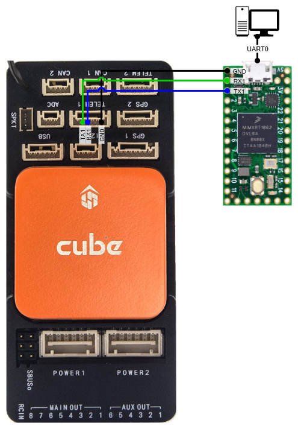
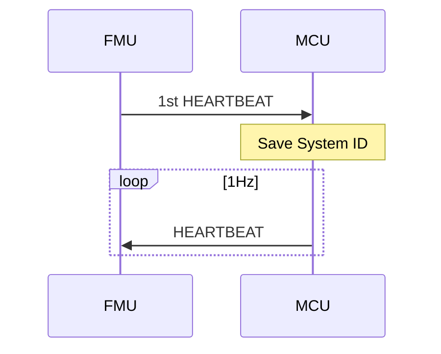

# Heartbeat / Connection Protocol - Simplified version

A simplified version of the protocol, where the MCU waits for the first HEARTBEAT message from the FMU, copies it's System ID, and starts broadcasting it's own HEARTBEAT messages with that System ID.

## Connections

| MCU port | FMU port |
| --- | --- |
| GND | GND |
| RX1 | TX1 |
| TX1 | RX1 |

## FMU settings

| Parameter key | Parameter value |
| --- | --- |
| SERIAL1_BAUD | 57 |
| SERIAL1_PROTOCOL | 2 |

## Program flow

