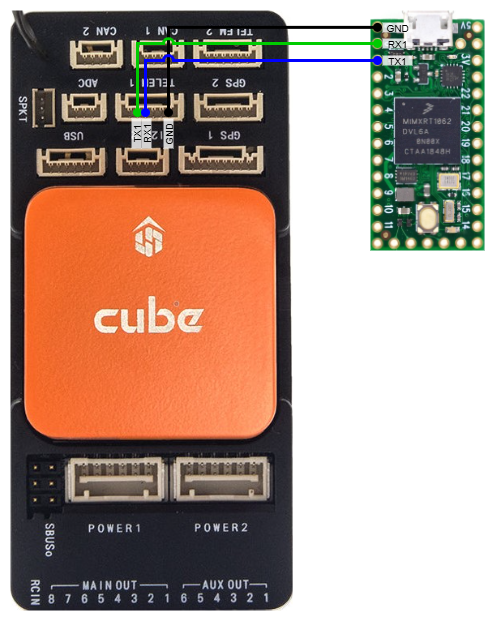

# Arduino MAVLink Microservices

Arduino compatible implementations for the MAVLink microservices listed at https://mavlink.io/en/services/

The examples were developed to a **Teensy 4.0 MCU**, connected to a **Cube Orange Standard Carrier Board** through **UART1** on both devices.

